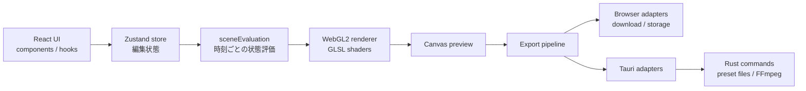

# アーキテクチャ

最終確認日: 2026-07-07

## 全体像

React UIは編集状態をZustandへ書き込みます。描画時には編集状態を直接シェーダーへ渡さず、`sceneEvaluation`が指定時刻の状態へ変換します。プレビューとエクスポートは同じ評価経路を使うことが重要です。

## 層と依存方向

### UI層

- `src/App.tsx`: 画面全体の構成、パネル、キャンバス、タイムラインを統合する。
- `src/components/`: 各パラメータの編集UIとオーバーレイを提供する。
- `src/hooks/`: WebGL、キャンバスサイズ、入力操作などのライフサイクルを扱う。

UIは状態の編集と利用者操作に集中させ、時間評価やファイル保存の詳細をコンポーネントへ重複実装しません。

### 状態・ドメイン層

- `src/store/gradientStore.ts`: 編集可能な状態、既定値、更新操作を保持する。
- `src/types/`: グラデーション、エフェクト、キーフレーム、描画スナップショットの型を定義する。
- `src/lib/sceneEvaluation.ts`: Static/Auto/Keysと時刻を解決し、描画可能な状態を作る。
- `src/lib/presetModel.ts`: プリセット永続化で共有する`Preset`、`StoreSnapshot`、型ガード、生成処理を定義する。

永続化対象を変更する場合は、`StoreSnapshot`、既定値、読み込み時の正規化、後方互換性を一組として検討します。プリセット型はアダプターごとに再定義せず、`presetModel`を一次情報にします。

### 描画層

- `src/lib/renderSceneAtTime.ts`: 評価済みシーンを描画関数へ接続する。
- `src/lib/webgl.ts`: WebGLコンテキスト、テクスチャ、uniform、描画パスを管理する。
- `src/shaders/`: GPU上で実行する各描画処理を保持する。
- `src/lib/renderBridge.ts`: UI上の描画器をエクスポート処理から呼び出す境界である。
- `src/lib/exportCanvas.ts`: 静止画エクスポートで共有するCanvas取得、タイル描画合成、PNG/JPEG/WebP Blob変換を担当する。

Postprocessのフラグメントシェーダーは`src/shaders/postprocess/`でuniform、共通処理、Prism、主スタック、Diffuse、Glass高さ場、Glass光学合成、エントリポイントに分割する。`src/lib/webglShaderSources.ts`がこの依存順に連結し、Glass専用、Prism専用、軽量主スタック、Legacyの各プログラムへ同じ構成元を供給する。分割ファイルを単独の完結したシェーダーとして扱わず、連結順とプリプロセッサ定義をコンパイル契約として維持する。

描画機能を追加するときは、型、既定値、UI、時刻評価、uniform、シェーダー、プリセット、エクスポート時の一致を確認します。

### プラットフォーム境界

`src/adapters/types.ts`がプリセット、カラーパレット、静止画、動画出力の契約を定義します。`src/adapters/index.ts`は実行環境を判定し、ブラウザ実装またはTauri実装を選択します。

ブラウザ固有APIやTauri APIを機能ロジックから直接呼ばず、既存のアダプター契約を経由します。新しいプラットフォーム能力が必要な場合は、最初に契約と非対応環境での振る舞いを仕様化します。

静止画エクスポートでは、CanvasをどのようにBlobへ変換するかを`exportCanvas`へ集約し、保存先ダイアログ、File System Access API、Tauriファイル書き込みは各アダプターに残します。これにより、描画結果の生成と保存先の違いを分けてレビューできます。

### Tauri/Rust層

`src-tauri/src/lib.rs`は次を担当します。

- アプリデータ領域にあるプリセットファイルの安全な置換と復旧
- 旧プリセット保存場所からの移行
- 外部FFmpegを利用したMOV/MP4エンコード
- Tauriプラグインとコマンドの登録

TauriコマンドはRendererからの入力を信頼しません。FFmpeg実行ファイルの探索と検証はRust側で行い、動画エンコードの入力パターンと出力ファイルはK-GGの一時書き出し領域内に限定します。OSのファイルブラウザを開く処理も、実行ファイル探索がPATHへ依存しないようにします。

アップデート処理のUI状態は`src/features/updater/`、配布設定は`src-tauri/tauri.conf.json`と`.github/workflows/release.yml`にあります。

## 主要データフロー

### プレビュー

1. パネルがストアを更新する。
2. `GradientCanvas`と`useWebGL`が最新状態を保持する。
3. `sceneEvaluation`が現在時刻のキーフレームと自動変化を評価する。
4. `renderSceneAtTime`がWebGL描画を実行する。

### エクスポート

1. エクスポート処理が出力フレームの正規化時刻を決める。
2. `renderBridge`経由でプレビューと同じ描画処理を呼ぶ。
3. 静止画では`exportCanvas`がCanvasから画像データを得る。
4. ブラウザではダウンロードまたはZIP化し、Tauriでは必要に応じてRust側でFFmpegを呼ぶ。

## 既知の設計上の注意

- `App.tsx`は画面統合の責務が大きい。新規ロジックを追加する際は、コンポーネント、hook、ドメイン関数へ分離できるか検討する。
- `gradientStore.ts`は多数の機能状態を集約する。破壊的な状態変更はプリセット互換性へ影響する。
- GLSL変更はTypeScript型検査だけでは検出できないため、ビルドに加えて実描画確認が必要である。
- ブラウザ/Tauriアダプターの重複を整理するときは、変換などの純粋な共通処理だけを`src/lib/`へ移し、権限、保存先、外部プロセス起動はプラットフォーム境界に残す。
