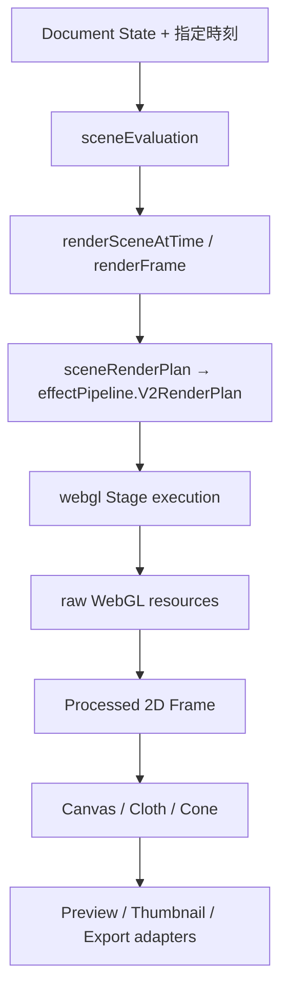

# Rendering Architecture

最終確認日: 2026-09-08。Request: [Issue #55](https://github.com/k5mp4/K-GG/issues/55)。既存の描画・保存契約を維持するTracked Changeとして、ADR-0004／0005／0017の実行境界を具体化する。新しいRender Planや描画アルゴリズムは追加しない。

## 入口と依存方向

`sceneEvaluation`はStatic／Auto／Keys、normalized time、秒単位のrender time、Noiseのloop period、Diffuse seed、Cloth専用時刻を決める純粋な処理であり、WebGL APIを呼ばない。React／ZustandはDocumentの編集と再描画の起動を担い、GPU textureの作成・更新はrendererへ委譲する。

`renderFrame`は名前付き入力を既存rendererの位置引数へ変換する互換境界である。`WebGL2RendererBackend`（`src/rendering/webgl2Renderer.ts`）は、raw WebGL ownerのinit／dispose facadeである。全面的に置き換える抽象Rendererや第二のpipelineは設けない。

## 正規Render Plan

`getSceneRenderPlanInput`が評価済み状態を純粋な入力へ写像し、`getSceneRenderPlan`が既存の`getV2RenderPlan`を呼ぶ。Legacyは`null`で従来の実行経路を選ぶ。これは別系統のV2 planではない。

V2 Planが決定するものは、正規化したEffect順序、有効レイヤー、analytic prefixの消費範囲と最初のtexture境界、既存Noise→Diffuse composition、Normal／Prism／Particles固定段、Generatorを含む必要program、Direct／Core／Full、必要なFramebufferの名前である。さらにWebGL2／RGBA8 framebufferのrequired capability、WebGL2不在時のCanvas2D fallback、Noise／Noise-Diffuse／Glass V2のprogram failure時に使うfallback先も同じPlanへ記録する。Flow／Seamless条件も同じ入力へ渡す。描画結果に使う時刻・seedの生成をGPU backendへ移さない。

`getRequiredSceneProgramKeys`はPreviewのreadinessとExportのprogram準備が共有する純粋な選択処理である。Image Gradient保護、Stipple、Glass identity、Legacy、Flow、Seamlessの既存条件を維持する。`webgl.getRequiredExportProgramKeys`は既存呼び出し用の再exportである。実行時のcompile完了・失敗はcontextの状態だが、失敗時にどのprogramへ退避するかはPlanのfallback policyを参照する。純粋なPlanへWebGLProgramやcontext stateを格納しない。

Render targetの寸法とtile offsetは名前付きframe入力の`width`／`height`／`tile`に属する。TileでもPlanは同じ関数で決定し、shaderやEffect順序を再実装しない。既存のSeamless、padding、full-resolutionとviewportの座標差は維持する。

## GPU資源の所有権

| 資源 | Ownerと再利用 | Resize／Invalidate／Dispose |
| --- | --- | --- |
| raw WebGL Program | `WebGLContext`のprogram slot。variantごとに一つ、Flowのslotも同じcompile queueを使用 | shader version変更は再init。loss／disposeで公開済み・未完了programを破棄 |
| Shader handle | 共通`createProgramAsync`がcompile／linkの間だけ所有 | 成否にかかわらずfinallyでdelete |
| Base／Normal／Blur／Prism／主Stack FBO＋Texture | `WebGLContext`が固定8組を所有。Planが必要な組のstorageだけ確保 | `webglResources`がtextureごとの寸法を記録し、同寸法のstorageを保持。disposeで全組delete |
| Ramp／Mesh／Diffuse LUT／ASCII／Distort／入力画像Texture | raw WebGL owner。Rampは評価値のsignatureが同じ間、CPU生成・転送を省略 | 変更時だけ更新。Ramp cacheはcontext単位のWeakMap、disposeで削除。画像Canvasは既存の更新規則を維持 |
| Transition texture＋program＋VBO | raw WebGL owner。Effect Stack表示ブレンド専用 | context寿命に従いdispose。表示ブレンドの時刻・順序は変更しない |
| Particle VAO／VBO | raw WebGL owner。seed／countに応じinstance bufferを更新 | disposeでdelete |
| Flow Texture／FBO／VAO／VBO | `FlowGradientResources`、親contextがdisposeを呼ぶ | Density 1＋Trail 2の固定構成。40% viewport、RGBA8、seek／session／loopで既存reset／prewarm |
| Three.js資源 | `ClothGradientRenderer`／`ConeViewRenderer`が各自のcontext、geometry、material、textureを所有 | 各rendererのdispose。生のGL handleをraw WebGL ownerに登録しない |

主Stackのping-pongはA／Bの固定2組であり、Effectを増やしても無制限にFBOを増やさない。入力textureを出力attachmentへ同時にbindするfeedbackは既存guardで拒否する。

以前はNormalまたはPrismが必要ならFullの8枚を一括確保していた。現在はNormal・Blurなしなら4枚、Normal＋Blurなら5枚、Prism・Glowなしなら4枚、Prism＋Glowなら6枚、両方の全機能では8枚を使う。Coreは3枚、Directは0枚。これはフルサイズの中間storage枚数であり、GL handle数ではない。一度確保した不要storageはcontext寿命まで保持し、再有効化時の再確保を避ける。サイズの履歴はtexture単位なので、Core／Fullと解像度を往復しても別グループの古いサイズ判定を流用しない。

ClothのRampは同寸法の`DataTexture`とCPU byte配列を再利用し、画素が変わったときだけ`needsUpdate`を立てる。寸法が変わる場合は従来どおりtextureを置換する。raw WebGLへCloth Canvasを転送した場合も、その実寸法をstorage管理へ記録する。

## ShaderとCapability

Source assemblyは`webglShaderSources`が所有する。compile-time variantはGenerator、Core、Noise、Glass、Prismなど既存の限定集合を使い、数値パラメータはuniformで更新する。新しいパラメータ値ごとにprogramを作らない。

共通compile処理がKHR完了通知、通常30秒watchdog後の同期status確認、Glassの既存無期限待機、エラー記録、Shader解放を扱う。contextごとのserial queueで同時compileを避ける。uniform反射に成功してからslotを公開し、同じpending promiseを共有する。Noise専用programの失敗は一般postprocessへ、Noise＋Diffuse compositionの失敗は既存の分離passへ戻る。Glassの待機／fallbackとExportの準備待ちは従来の方針を維持し、見た目の修正を混ぜない。

`webglCapability`がWebGL2取得とページ上の利用可否を扱い、`gpuDiagnostics`がcontext初期化時に上限・GPU特性を取得する。毎frameのMAX_TEXTURE_SIZE問い合わせはこのsnapshotを読む。raw WebGLのfloat linear／color-buffer-float／parallel-compile extensionはinit境界で問い合わせ、Profilerのoptional extensionは既存の安全な問い合わせ処理を使う。開発用Validationの切替を観測するextensionまで永続cacheへ閉じ込めない。

RGBA8 FBOの完全性はstorage変更時、Flowはresize時に確認する。WebGL2がない場合はCanvas2Dの簡易Previewを使う。Canvas2Dは全Effectの同等実装ではなく、thumbnail fallbackやtile合成にも使う。GPU tierによる既存optimization値、16M-pixelのV2安全上限、tileサイズ制限は変更しない。

## Context Lost／Restore

raw WebGLのloss listenerはeventをpreventDefaultし、ledgerへ記録してownerをdisposeする。`renderSceneAtTime`／raw renderはlostまたはdisposedのcontextへ描画しない。pending compileもdisposedを見て公開を止める。

Preview coordinatorの`useWebGL`はcontext参照を外し、readyをfalseにしてAnimation loopのcleanupを起動する。restore時はepochを進め、capability、program、texture、FBO、Flowを新しいownerとして初期化してSceneを再描画する。hookとraw ownerのdispose重複はidempotentである。Thumbnailは次のcapture時に無効なcached ownerを除去して再initする。

Three.jsの別contextはraw WebGLの復旧queueへ混ぜない。Cloth／Cone view componentは補助contextのlossを検出して既存fallbackと再構成を担当する。raw Baseとして使うClothの資源は親ownerと共にdisposeされる。source change／HMRも古いownerを破棄してから新規作成する。

## 出力経路と3D境界

| 経路 | 共有部分 | 意図的に異なる部分 |
| --- | --- | --- |
| Preview | Scene Evaluation、Plan、raw execution | React購読、RAF、編集中のTransition |
| Thumbnail | `createPresetThumbnailState`→`renderSceneAtTime`→同じPlan | hidden singleton、320×200、time 0、portable presetにない外部画像を除外 |
| Still／PNG Sequence | `renderBridge`→同じScene／Plan | Blob生成、ZIP、保存先と連番時刻の制御 |
| Browser video／Tauri video | 共通frame生成、時刻・seed・Plan | Browser保存とTauri一時PNG／FFmpeg encoding。Rust境界は変更しない |
| Tile | 同じframe／Scene／Plan | viewport、offset、padding、Canvas2Dへの合成 |
| Cloth／Cone表示面 | 処理済み2D frameとprocessed canvas clock | Three.jsによるマッピング、camera、geometry、別canvas。主Stackに3D処理を追加しない |

ClothはBase generatorとしての既存経路と、処理済みCanvasを貼るview adapter経路の二役を持つ。Coneは処理済みCanvasのview adapterである。OGLは`components/Backgrounds/Iridescence.tsx`の装飾背景用componentにのみあり、現在の描画入口からの利用箇所はない。EffectのIridescence／Fluid Warpはraw GLSLであり、OGLの背景と混同しない。未使用OGL componentのcleanup改善は描画基盤へ混ぜず、再利用時の別作業とする。

## 変更時の判断基準と検証

新Effectはまず既存`V2RenderPlan`へ順序・texture境界・program／target要求を追加し、その後stageを実装する。出力adapterごとにShader選択を増やさない。新しいresourceはowner、初期化失敗時の解放、resize、loss、disposeを一組で実装する。Three.js／OGLはライブラリのcacheを尊重し、raw GLのpoolへ統合しない。

今回の最適化はstorage確保、Rampの更新、GPU上限問い合わせの削減であり、シェーダー計算、Effect順序、Seed／Time、Preset schema、Export形式を変えない。GPU→CPU readbackも追加しない。実時間のGPU速度向上率は測定していない。

`check:render`、`check:merge`、Browser E2E、既存RGBA captureを使用する。代表PresetのソフトウェアWebGLでの一致を、全Effect・全GPU・Nativeの保証へ拡大しない。commit間の固定GPU Release Gateは[Validation](./validation.md)とIssue #46〜#53に従う。Noise→Diffuseの見た目改善（#45）、未使用OGL、実GPU／Native確認は今回の実装と分離する。
