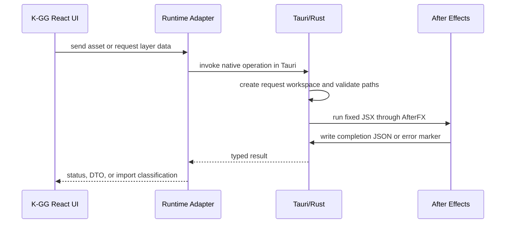

# K-GG After Effects Native Integration - Plan

## Goal Capsule

- **Objective:** Tauri版K-GGから、別途Bridgeを手動起動せずにAfter Effectsへ画像・動画を送り、段階的にAEレイヤー情報と対応可能な設定をK-GGで利用できるようにする。
- **Means:** Tauri/Rustが固定JSX、一時作業領域、AEプロセス実行、完了結果を管理し、Web版は既存Bridge経路を維持する（KTD1, KTD2, KTD3）。
- **Authority:** ユーザーが確認したP0〜P3の範囲、CHANGE-038、CURRENT-AFTER-EFFECTS-INTEGRATION、ADR-0018、既存テスト、実装の順に扱う。
- **Stop conditions:** P0の実機送信、失敗処理、作業領域の安全性が確認できない場合はP1以降へ進めず、CHANGE-038をactiveに残す。
- **Execution profile:** P0から順に実装し、各段階の自動テストと実機確認が完了してから次段階へ進む。
- **Tail ownership:** 全段階の検証、current specへの統合、利用者向け文書の同期、CHANGE-038のArchive移動までをこの変更の完了条件とする。

---

## Product Contract

### Summary

Tauri版K-GGへAfter Effects接続を内包し、画像・動画送信を最初に実装する。その後、AEレイヤーの一方向読み込み、素材・レンダー結果の取り込み、対応可能なKagaribi設定の変換を追加する。

### Problem Frame

現在のAfter Effects連携は、ローカルTauri版でも別プロセスの`KGG_AE_Bridge`を利用者が起動しなければならない。これにより、ローカルアプリであるにもかかわらず、ポートとBridgeのプロセス状態が利用者操作に残っている。

現在のK-GGは単一シーンと固定種別のEffect Stackを編集する。After Effectsの任意レイヤーグラフとはデータモデルが異なるため、レイヤー取り込みはメタデータ、素材、レンダー結果、対応設定の段階に分ける必要がある。

### Requirements

#### P0: Tauri単独の送信

- R1. Tauri版K-GGは、別途`KGG_AE_Bridge`を手動起動せず、現在のCanvas画像をAfter Effectsへ送信できる。
- R2. Tauri版K-GGは、直前に書き出したMOVまたはMP4をAfter Effectsへ送信できる。
- R3. Web版は既存の`KGG_AE_Bridge`経路で画像・動画を送信できる。
- R4. 送信先は利用者指定の保存先を優先し、未指定または利用できない場合はAfter Effectsプロジェクトの場所またはK-GG一時領域へフォールバックする。
- R5. AE未起動、保存失敗、JSX失敗、対象コンポジション不在を送信失敗として判別できる。

#### P1: レイヤー情報の読み込み

- R6. K-GGは選択コンポジションまたは選択レイヤーの情報を一方向に読み込める。
- R7. 読み込み結果はレイヤーID、名前、種類、有効状態、時間範囲、変形、素材参照、対応可能なプロパティを含むDTOとして扱う。
- R8. 非対応のAEプロパティはK-GGで編集可能な設定として扱わない。

#### P2: 素材・レンダー結果の取り込み

- R9. Footageレイヤーは元ファイル参照として識別できる。
- R10. 元ファイルを取得できないレイヤーはAEの一時レンダー結果として識別できる。
- R11. 元ファイル取り込みとレンダー結果取り込みの編集可否をK-GG側で区別できる。

#### P3: 対応設定の変換

- R12. Kagaribiエフェクトの対応表を持つパラメータだけをK-GG設定へ変換できる。
- R13. 非対応エフェクト、式、マスク、3D、親子関係はK-GGの設定へ変換しない。

### Actors

- A1. K-GG利用者: Export Panelから送信・接続確認・将来のレイヤー読み込みを開始する。
- A2. K-GG Tauri Runtime: ローカルファイル、一時作業領域、After Effectsプロセス、完了結果を管理する。
- A3. After Effects: JSXを実行し、プロジェクト・コンポジション・レイヤー・素材を提供または変更する。

### Key Flows

- F1. **画像・動画送信:** 利用者が送信操作を開始し、K-GGが作業領域へ保存し、AEへ固定操作を依頼し、成功または失敗を表示する。Covers R1〜R5.
- F2. **レイヤー読み込み:** 利用者が対象を指定し、AEがレイヤー情報をJSON化し、K-GGがDTOとして表示または次段階の取り込みへ渡す。Covers R6〜R8.
- F3. **素材・設定取り込み:** K-GGがレイヤーをFootage、レンダー結果、対応設定、非対応項目へ分類する。Covers R9〜R13.

### Acceptance Examples

- AE1. **BridgeなしのPNG送信:** Given Tauri版K-GGと起動済みAfter Effectsがあり、When 利用者が現在の画像を送信すると、Then K-GGがBridgeなしでAEコンポジションへ新規フッテージレイヤーを追加し、成功状態を表示する。
- AE2. **Bridgeなしの動画送信:** Given Tauri版K-GGでMOVまたはMP4を書き出し済みで、When 利用者が自動または手動送信すると、Then AEへ動画レイヤーを追加し、成功状態を表示する。
- AE3. **AE未起動:** Given After Effectsが起動していない状態で、When 利用者が接続確認または送信を行うと、Then K-GGは送信成功と表示せず、AE未起動として判別できる状態を表示する。
- AE4. **選択レイヤー読み込み:** Given AEで複数レイヤーの一部を選択して、When K-GGが読み込みを行うと、Then選択レイヤーの識別情報をDTOとして返し、非対応プロパティを編集可能設定へ変換しない。
- AE5. **Footageとレンダー結果の区別:** Given Footage、テキスト、シェイプ、プリコンポのレイヤーを含むコンポジションで、When K-GGが取り込み分類を行うと、Then元ファイル参照とレンダー結果を別種別として扱う。

### Success Criteria

- S1. Tauri版のP0操作に利用者が別Bridgeを起動する手順がない。
- S2. Web版の既存Bridge連携が維持される。
- S3. P0の送信失敗が、AE未起動、保存失敗、JSX失敗、対象不在のいずれかとして切り分けられる。
- S4. AEレイヤーの非対応情報が、K-GGで編集可能な設定として誤表示されない。

### Scope Boundaries

- P0〜P3をこの変更の対象とする。
- P0ではAfter Effects本体が起動済みであることを前提とする。AE本体の自動起動は対象外とする。
- 任意のAEレイヤーグラフの完全変換、リアルタイム双方向同期、複数AEインスタンス操作は`#### Deferred to Follow-Up Work`へ延期する。

#### Deferred to Follow-Up Work

- AEの常駐パネルや拡張を使ったリアルタイム双方向同期。
- マスク、式、テキスト、シェイプ、親子関係、3Dカメラを含む完全な編集可能レイヤーグラフ。
- macOSを正式配布対象としたAutomation権限、署名、実機検証の追加設計。

### Dependencies

- 利用者の環境にAfter Effects本体がインストールされ、P0では起動している。
- Windows x64 Tauri配布が現在の主検証対象である。
- AEのスクリプト実行機能と、K-GGからアクセス可能な一時ファイル領域が利用できる。

### Sources

- Repository baseline: `src/lib/aftereffectsExport.ts`, `src/components/ExportPanel.tsx`, `src-tauri/src/lib.rs`, `src-tauri/tauri.conf.json`, `src-tauri/capabilities/default.json`.
- Migration source: 既存のローカルAE Bridge実装（本リポジトリ外）を現行動作の基準として参照する。
- [Adobe After Effects developer page](https://developer.adobe.com/after-effects/)
- [After Effects Scripting Guide: command-line scripting](https://ae-scripting.docsforadobe.dev/introduction/overview/)
- [CompItem](https://ae-scripting.docsforadobe.dev/item/compitem/), [Layer](https://ae-scripting.docsforadobe.dev/layer/layer/), [Property](https://ae-scripting.docsforadobe.dev/property/property/), [RenderQueue](https://ae-scripting.docsforadobe.dev/renderqueue/renderqueue/)

---

## Planning Contract

### Key Technical Decisions

- KTD1. **Tauri/Rust内製コネクタ:** After Effects操作をSidecarではなくTauri/Rust commandへ移す。BridgeをK-GGが同梱して自動起動する案も比較したが、P0では別プロセスの配布・起動・終了・バージョン整合とHTTPポートを残すため採用しない。これで別Bridgeの手動起動、常駐HTTPポート、Sidecarの配布管理をP0から除く。Governs R1, R2, R5.
- KTD2. **Web/TauriのAdapter分離:** Web版は既存HTTP Bridge、Tauri版はTauri commandを使う。UIは実行環境差を直接扱わない。Governs R1, R2, R3.
- KTD3. **固定JSXと一時ファイル:** 大きなバイナリは一時作業領域へ保存し、固定操作のJSXと完了JSONでAEと往復する。任意JSX本文と未検証パスは受け付けない。Governs R4, R5, R7.
- KTD4. **レイヤーDTOの分離:** AEレイヤー情報はK-GGの`StoreSnapshot`へ直接追加せず、読み込み専用DTOとして扱う。P3の変換表を通った項目だけをK-GG設定へ渡す。Governs R6〜R13.
- KTD5. **段階ゲート:** P0の実機送信と失敗処理を確認してからP1へ進み、P1のレイヤー種別と対応/非対応メタデータ分類を確認してからP2のFootage対レンダー分類・P3の設定変換へ進む。Governs R1〜R13.

### High-Level Technical Design

The Rust connector owns OS paths and process execution. The React layer owns user intent and display state. The AE script owns only the requested project operation. The work directory is removed after the result is collected.

### Assumptions

- After Effects remains a separately installed application and must be running for P0 operations.
- The current Windows x64 Tauri package is the first real-device validation target.
- Browser-side Bridge compatibility is preserved until a separate migration decision is approved.

### Risks & Dependencies

- **AE process contract:** AfterFX invocation can return before the JSX operation has written its result. The completion marker must be the success boundary.
- **Path and code safety:** AE script construction must use fixed operation templates, strict filename rules, and path escaping. No user-supplied JSX is permitted.
- **Composition ambiguity:** The active viewer, active item, and first composition are not equivalent. P1 must return an explicit ambiguity error instead of silently selecting an unrelated composition.
- **Model mismatch:** K-GG's `StoreSnapshot` and `EffectPipelineConfig` do not represent arbitrary AE layers. The DTO boundary prevents accidental full-fidelity claims.
- **Manual verification:** Automated tests can validate request construction and parsing, but an AE installation is needed for the final send and layer smoke checks.

### Sequencing

P0 establishes the connector and sends image/video assets. P1 adds one-shot layer inspection. P2 adds source and render classification. P3 adds only the parameter mappings that have explicit tests. No later phase may weaken P0 error handling or path validation.

---

## Implementation Units

### U1. Native After Effects connector

**Goal:** Add a Tauri/Rust connector that detects a running After Effects instance, manages a request workspace, executes fixed JSX, and returns an unambiguous result.

**Requirements:** R1, R2, R4, R5.

**Dependencies:** None.

**Files:** `src-tauri/src/after_effects.rs`, `src-tauri/src/lib.rs`, `src-tauri/capabilities/default.json`, `src-tauri/tauri.conf.json`, `src-tauri/src/after_effects.rs` tests.

**Approach:**

1. Isolate pure path validation, filename normalization, JSX escaping, command argument construction, and completion-result parsing so they can be unit tested without AE.
2. Reuse the existing Tauri/Rust external-process and temporary-directory conventions.
3. Resolve the AE project directory through a fixed JSX marker when no custom save directory is usable; use the request workspace when the project is unsaved or the marker is unavailable.
4. Create each request directory with an OS-generated unpredictable nonce and exclusive creation, reject reparse points/symbolic links, create request files without overwriting, and verify the request ID and operation kind in the completion result.
5. Copy only validated PNG/MOV/MP4 input from the approved temporary area, reject assets over the initial 2 GiB limit or a destination that cannot be canonicalized as an existing directory, and never overwrite outside the selected destination. Completion JSON is limited to 256 KiB and the AE operation has a 120-second timeout.
6. Serialize AE operations and give each request its own completion result. Remove the request workspace on both success and failure after the result is collected, including timeout and process-failure paths.
7. Keep AE process detection and OS-specific invocation behind the native connector. On Windows x64, obtain the executable path from the running AfterFX process and invoke `AfterFX.exe -r <jsx>` directly; return a distinct unsupported result on other targets. Select only the active viewer/active composition explicitly; do not silently fall back to the first composition.

**Patterns to follow:** Existing FFmpeg command validation, hidden process configuration, `spawn_blocking`, and `src-tauri/src/lib.rs` unit tests.

**Test scenarios:**

- A valid PNG, MOV, and MP4 request produces the expected fixed operation and workspace paths.
- Names containing spaces, quotes, separators, and non-ASCII characters are normalized or escaped without changing the operation template.
- A path outside the permitted temporary or selected save directory, a missing/non-directory selected destination, and an input over the documented maximum size are rejected before process execution.
- A saved AE project is preferred when no custom directory is usable; an unsaved project falls back to the request workspace.
- AE is not running, the executable cannot be found, the JSX process fails, and the completion result is missing each produce a non-success result.
- A tampered, mismatched, oversized, or truncated completion result is rejected, and a timed-out AE operation removes its request workspace.
- Two concurrent requests execute in order and do not consume each other's completion files.
- A successful and failed request both remove their temporary workspace after collecting the completion result.

**Verification:** Rust unit tests pass, and the command is registered with the Tauri handler while capabilities remain limited to the required local operations.

### U2. Runtime Adapter and web compatibility

**Goal:** Route AE operations through the existing browser/Tauri Adapter pattern while preserving the web Bridge behavior.

**Requirements:** R1, R2, R3, R4, R5.

**Dependencies:** U1.

**Files:** `src/adapters/types.ts`, `src/adapters/index.ts`, `src/adapters/browser/afterEffectsService.ts`, `src/adapters/tauri/afterEffectsService.ts`, `src/adapters/tauri/exportService.ts`, `src/lib/aftereffectsExport.ts`, `src/lib/aftereffectsExport.test.ts`.

**Approach:**

1. Define one service contract for status, ping, save-directory operations, image transfer, and video transfer.
2. Move the current HTTP implementation behind the browser service without changing its public behavior.
3. Add a Tauri service that writes large blobs to the approved temporary area and invokes U1 with a path.
4. Validate the custom directory first. If it is absent or unusable, ask U1 for the saved AE project directory through a fixed marker operation; if AE is unsaved or the marker is unavailable, use the request workspace. Return the selected/project/temp destination kind in the result.
5. Map native results to `ok`, `not-running`, `save-failed`, `jsx-failed`, `composition-unavailable`, `unsupported`, and `error`; the UI never treats any non-`ok` result as success.
6. Keep the existing facade names during migration so Export Panel behavior changes only at the runtime boundary. The Tauri command is callable only through the packaged main window's minimal capability and receives allow-listed operation, extension, path, and size inputs; production continues to load the bundled frontend rather than a remote origin.

**Patterns to follow:** `src/adapters/index.ts`, `src/adapters/tauri/exportService.ts`, `src/adapters/tauri/videoExportService.ts`, and `isTauriRuntime()`.

**Test scenarios:**

- Browser runtime uses the existing Bridge endpoint contract for status, save directory, PNG, and MOV/MP4 operations.
- Tauri runtime uses native invocation and never constructs a `localhost:7749` request.
- A large video blob is written to a temporary path and the native service receives the path rather than an in-memory JSON payload.
- Service-level native errors are mapped to `not-running` or `error` without reporting success.
- Save-directory selection, clearing, missing-directory fallback, and cancellation preserve the existing UI contract.

**Verification:** TypeScript tests cover both runtime adapters and the facade, and a source-level check confirms the Tauri path has no HTTP Bridge dependency.

### U3. P0 Export Panel integration

**Goal:** Make the existing image send, video send, connection test, and automatic video-send controls work through the runtime service.

**Requirements:** R1, R2, R3, R5.

**Dependencies:** U2.

**Files:** `src/components/ExportPanel.tsx`, `src/i18n/messages.ts`, `src/lib/aftereffectsExport.test.ts`.

**Approach:** Preserve the current controls and last-exported-video behavior, but display AE connectivity rather than Bridge process availability in Tauri. P0 targets the active AE viewer/active composition only; when none is available, show that instruction and let the user retry after activating a composition in AE. Define explicit connecting, connected, AE-not-running, save-failed, JSX-failed, and composition-unavailable states with retry behavior; keep browser-only Bridge wording and behavior behind the browser adapter.

**Execution note:** This unit is mostly UI wiring and platform packaging. Use a smoke-first manual check with Bridge stopped after the service tests pass.

**Patterns to follow:** Existing Export Panel state transitions, video export completion handling, and `nativeFfmpegSupported` runtime branching.

**Test scenarios:**

- With Tauri runtime selected, the image button sends the current output canvas and shows sending, success, or failure state.
- After a successful MOV or MP4 export, automatic send invokes the Tauri service once with the matching extension.
- Manual send uses the most recent video and remains disabled until a video exists.
- AE not running leaves the success message unset and shows a recoverable connection state.
- Browser runtime retains the existing Bridge check and send behavior.

**Verification:** UI smoke confirmation proves PNG, MOV, and MP4 flows with the separate Bridge process stopped; browser behavior is checked separately.

### U4. P1 Layer inspection DTO

**Goal:** Read selected AE composition and layer metadata through the native connector without claiming full editability.

**Requirements:** R6, R7, R8.

**Dependencies:** U1, U2.

**Files:** `src/types/afterEffects.ts`, `src/lib/afterEffectsLayer.ts`, `src/lib/afterEffectsLayer.test.ts`, `src/adapters/tauri/afterEffectsService.ts`, `src/components/AfterEffectsImportPanel.tsx`.

**Approach:** Add a dedicated After Effects import panel with a read-only layer list, selection state, and read-only/unsupported badges. The panel reads the active composition even when no layer is selected, and reads only selected layers when a selection exists. Use a fixed AE inspection script to enumerate the explicit target composition and selected layers, serialize stable identifiers and supported values, and label unsupported properties. The versioned DTO uses seconds for time, pixels for position, percent for scale/opacity, degrees for rotation, the AE `Layer.id` integer as the project-local identifier, and explicit nullable/union source fields. Do not fall back silently to the first composition.

The initial DTO envelope is `{ schemaVersion, operation, composition, layers, unsupported }`; `composition` contains the active composition id/name, and each layer contains `id`, `name`, `kind`, `selected`, `enabled`, `inPoint`, `outPoint`, `startTime`, `transform`, `source`, `supportedProperties`, and `unsupportedProperties`. `source` is a tagged union for `footage`, `precomp`, `generated`, or `missing`, and every native error uses the same status envelope as P0.

**Patterns to follow:** Existing typed domain models, normalizers, and Tauri temporary-file round trips.

**Test scenarios:**

- A selected layer returns a stable identifier, name, kind, enabled state, timing, transform, and source classification.
- Multiple selected layers preserve their AE order and identifiers.
- No active composition and ambiguous target selection return distinct non-success outcomes; an active composition with no selected layers returns a valid composition DTO with an empty layer list.
- Keyframed and expression-backed properties are represented as unsupported or read-only when no K-GG mapping exists.
- Malformed, truncated, or version-mismatched JSON is rejected without mutating K-GG state.

**Verification:** DTO parsing and unsupported-field behavior pass unit tests, and a real AE smoke test confirms the selected-layer list.

### U5. P2 Source and render import

**Goal:** Classify and import AE Footage sources or rendered layer output while retaining the distinction between editable source and flattened media.

**Requirements:** R9, R10, R11.

**Dependencies:** U4.

**Files:** `src/lib/afterEffectsImport.ts`, `src/lib/afterEffectsImport.test.ts`, `src/types/afterEffects.ts`, `src/adapters/tauri/afterEffectsService.ts`, `src/components/ExportPanel.tsx` or dedicated AE import UI.

**Approach:** Return a source path only for valid Footage items after explicit user confirmation, canonicalization, allowed-root and file-type checks. A missing or inaccessible Footage source requests an explicit temporary render; for text, shape, precomp, or unsupported source types, request the same render path and return it as flattened media with its editability flag. Rendering defines its target composition, time range, output format, cancellation, timeout, and cleanup contract before implementation.

**Patterns to follow:** Existing Canvas/blob export, Tauri file writing, and video export temporary-directory cleanup.

**Test scenarios:**

- A Footage layer with an existing file returns a source import classification.
- A missing or inaccessible Footage file requests a render fallback; only render failure or cancellation returns a failure, and no arbitrary path is copied.
- Text, shape, and precomp layers return a render classification and do not claim source editability.
- Render cancellation and AE render failure clean up intermediate files and report failure.
- Imported source and flattened render classifications remain distinct after the UI handoff.

**Verification:** Unit tests cover classification and cleanup, and AE manual checks cover one footage layer and one non-footage layer. Any source-path import requires explicit user confirmation, canonicalization, an allowed-root/file-type check, and a rejection path before copying.

### U6. P3 Kagaribi parameter conversion

**Goal:** Convert only tested Kagaribi AE parameters into K-GG settings and preserve unsupported information as non-editable diagnostics.

**Requirements:** R12, R13.

**Dependencies:** U4.

**Files:** `src/lib/afterEffectsImport.ts`, `src/lib/afterEffectsImport.test.ts`, `src/types/afterEffects.ts`, `src/types/gradient.ts`, `src/types/distortion.ts`.

**Approach:** Define a versioned mapping table for the shared parameter subset. Apply existing K-GG normalizers at the conversion boundary. Reject unknown values and do not write converted data directly into a Preset until the mapping is complete.

**Patterns to follow:** Existing preset normalizers, parameter limits, and Effect Stack type guards.

**Test scenarios:**

- Supported gradient, color, position, noise, and slit parameters convert to the expected K-GG values.
- Values outside K-GG limits are normalized by the existing boundary rules.
- Unknown match names, expressions, masks, 3D settings, and parent relationships remain unconverted.
- A partial conversion reports converted and unsupported fields separately.
- Conversion never changes the current K-GG StoreSnapshot when any required source data is invalid.

**Verification:** Mapping tests pass against representative AE payloads, and manual AE validation confirms at least one supported and one unsupported effect case.

### U7. Documentation, packaging, and release validation

**Goal:** Keep the current spec, change package, ADR, UI guidance, and Tauri packaging contract synchronized with the implemented phases.

**Requirements:** R1〜R13.

**Dependencies:** U1〜U6 as implemented.

**Files:** `docs/specs/current/after-effects-integration.md`, `docs/specs/current/index.md`, `docs/changes/active/index.md`, `docs/changes/active/CHANGE-038-after-effects-native-integration/`, `docs/adr/0018-tauri-after-effects-connector.md`, `docs/adr/index.md`, `src/docs/help.md`, `src/docs/help.en.md`.

**Approach:** Update user-facing instructions only for behavior that has passed validation. Keep CHANGE-038 active while any phase or acceptance condition is incomplete. Integrate the final delta into the current spec only after all accepted phases are complete.

**Test expectation:** Documentation and packaging unit; behavioral proof is supplied by the referenced unit tests and manual smoke scenarios.

**Verification:** Documentation checks, documentation build, application build, Rust checks, and the Windows Tauri smoke checklist pass before archiving the change.

---

## Verification Contract

### Automated gates

- `npm run docs:check` validates current spec, change, ADR, and index references.
- `npm run docs:build` validates documentation rendering.
- `npm test` validates TypeScript service, DTO, mapping, and regression tests.
- `npm run lint` validates TypeScript and React changes.
- `npm run build` validates the frontend and Tauri-facing TypeScript boundary.
- `cargo test --manifest-path src-tauri/Cargo.toml` validates native connector helpers and existing Rust behavior.
- `cargo check --manifest-path src-tauri/Cargo.toml` validates Tauri command registration and native compilation.

### Manual integration gates

- With `KGG_AE_Bridge` stopped and After Effects running, Tauri K-GG sends a PNG, MOV, and MP4 into the intended AE composition.
- With After Effects stopped, Tauri K-GG reports a non-success state and does not leave a false success indicator.
- A project with a custom save directory, an unsaved project, and a missing custom directory follows the documented save-source behavior.
- A project with selected footage, text, shape, and precomp layers returns the expected P1/P2 classifications.
- A Kagaribi effect containing supported and unsupported properties produces a partial conversion without mutating invalid state.
- Web runtime continues using its existing Bridge flow.

### Security review gate

Review the native connector for arbitrary JSX execution, path traversal, uncontrolled child-process arguments, temporary-file tampering, source-path authorization, caller/capability boundaries, the 2 GiB asset and 256 KiB result limits, the 120-second timeout, cleanup after timeout, and unbounded payload handling before the P0 release build. The packaged main window is the only production caller; production must load the bundled frontend rather than a remote origin, and command inputs remain allow-listed in Rust.

---

## Definition of Done

- Every implemented phase has its unit tests and manual scenarios recorded in `CHANGE-038` `validation.md`.
- Tauri版P0 succeeds with the separate Bridge process stopped.
- Web版の既存Bridge連携に回帰がない。
- Unsupported AE structures are visibly non-editable and are not silently written into K-GG presets.
- The current spec, ADR, active change, tests, UI guidance, and package configuration describe the same behavior.
- `npm run docs:check`, `npm run docs:build`, `npm test`, `npm run lint`, `npm run build`, `cargo test --manifest-path src-tauri/Cargo.toml`, and `cargo check --manifest-path src-tauri/Cargo.toml` pass.
- No unrelated SANDBOX/Cone changes are included in the AE integration diff.
- Failed experiments, abandoned connector paths, and dead compatibility code are removed before the change is archived.
