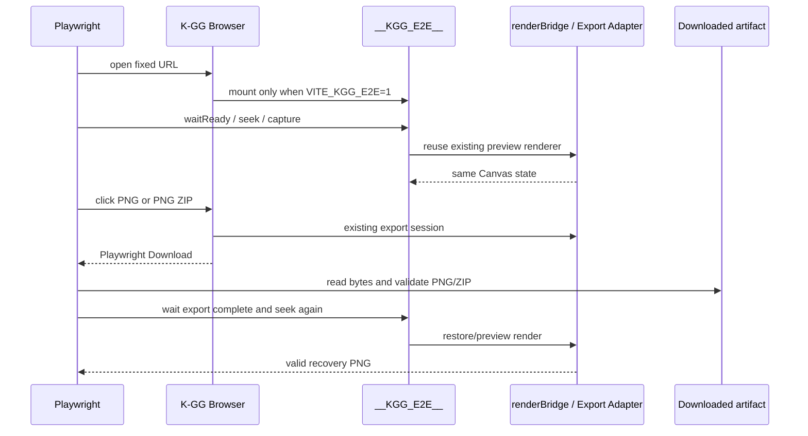

# K-GG Browser Export Validation Foundation - Plan

## Goal Capsule

- **Objective:** 実ブラウザ上でK-GGのPreview描画とPNG/PNG ZIP書き出しを起動し、壊れた画像、誤った寸法、欠落・重複したフレーム、未処理のページエラーをMerge Gateで自動検出できる最初の縦切りを追加する。
- **Means:** Playwrightの固定条件、`VITE_KGG_E2E=1`でのみ有効な決定的描画ブリッジ、PNG/ZIPのバイナリ検証ヘルパー、ブラウザE2E smokeを追加する。通常の描画・Export Pipeline・ユーザーUIは既存経路を再利用する。
- **Authority:** GitHub Issue #46の親方針と#47/#48の受入条件、`docs/specs/current/video-export.md`、`docs/specs/current/webgl-performance.md`、`docs/development/validation.md`、ADR-0015/0019、既存の`renderBridge`/`renderGolden`/Export Adapter実装の順に扱う。
- **Stop conditions:** E2Eフラグなしの本番ビルドにブリッジが残る、Playwrightが実際のCanvasを待てない、またはPreview復帰を確認できない場合は、#49以降の比較・診断段階へ進めず、この段階の修正に留める。
- **Execution profile:** U1のテスト基盤、U2のブリッジ、U3の成果物検証、U4のPreview/Export smoke、U5の開発者向けGate文書の順に実装し、各段階を検証してから次へ進む。
- **Tail ownership:** この段階の自動テスト、型/lint/build確認、Merge/Release/Observationの境界文書、未実行の手動・固定GPU・Tauri検証の明示までを完了条件とする。コミット・push・PR作成はユーザーの明示依頼がないため対象外とする。

## Product Contract

### Summary

Issue #46で定義された検証自動化のうち、最初にBrowser Merge Gateへ載せられる実ブラウザ基盤とPNG系Exportの完全性検証を実装する。ここで検証するのは「ファイルがPNGとして読める」「PNGの寸法がCanvasと一致する」「ZIPの全フレームが連番で存在し各PNGが読める」「Export後も同じPreview Canvasが描画可能である」という観測可能な契約である。画素のbase/head比較、固定GPUのRelease Gate、WebGLリソース診断、Tauri/FFmpegは後続段階とする。

### Problem Frame

現在の単体テストはrender planやexport sessionの整合性を検証できるが、ブラウザでWebGL Canvasを実際に初期化し、PNGまたはPNG ZIPを生成し、生成されたバイナリを読み直す経路がMerge Gateにない。そのため、白画面、Context初期化失敗、空/壊れたPNG、ZIP内の欠落フレーム、Export後のPreview未復帰を自動で検出できない。

Issue #46は、Browser/WebGLの再現可能なソフトウェア検証と、固定GPU・NativeのRelease Gateを同一視しない段階導入を求めている。今回の段階では、ソフトウェアWebGLで再現可能なブラウザ検証だけを新設する。

### Requirements

#### R1. Playwright実行基盤

- `@playwright/test`、`playwright.config.ts`、`tests/e2e/`を追加し、`npm run check:e2e`でローカルまたはCIから同じ入口で起動できる。
- テストは固定viewport、`deviceScaleFactor: 1`、固定URL/ポート、ダウンロード許可、失敗時のtrace・screenshot・videoを使用する。
- ChromiumはソフトウェアWebGLを優先する起動条件を持ち、テスト結果にはブラウザ、OS、Canvas寸法、WebGL/GPU診断を添付する。
- `pageerror`、予期しない`console.error`、`unhandledrejection`を未処理のまま成功にしない。

#### R2. Deterministic render bridge

- `VITE_KGG_E2E=1`の開発サーバーでだけ、既存Canvasと`renderBridge`へ接続するE2E専用の`window.__KGG_E2E__`を公開する。
- ブリッジはWebGL ready待ち、アニメーション停止、正規化時刻の設定、Canvas PNG取得、診断取得、Export完了待ちを提供する。
- `renderSceneAtTime`/`renderBridge`/既存Export Adapterを呼び出し、E2E専用のRenderer、Canvas、Render Loop、Shaderを作らない。
- E2EフラグがないProduction buildにはブリッジの公開名・実行コードを含めず、通常のUI操作と描画結果を変更しない。

#### R3. Preview smoke

- 実ブラウザでアプリが白画面にならず、`kgg-preview-canvas`が表示され、0、0.5、1の正規化時刻を順に設定してCanvas PNGを取得できる。
- 各取得画像はPNG signatureとIHDR寸法が有効で、Canvasの期待寸法と一致する。
- 同じ時刻を同じ条件で再取得したとき、少なくとも画像データが空でないことを確認する。固定GPU画素一致の判定はこの段階の受入条件にしない。

#### R4. PNG/PNG ZIP Export smoke

- UIからPNGをダウンロードし、PlaywrightのDownloadを完了させ、生成ファイルを実際に読み戻してPNG signatureと寸法を検証する。
- UIから短いアニメーション設定のPNG ZIPをダウンロードし、ZIPを展開してフレーム数、`frame_0000.png`から始まる連番、各PNGのsignatureと寸法を検証する。
- Export完了後、同じPreview Canvasで別の時刻を描画・取得できることを確認する。ExportがPreview用Canvasやrender sessionを壊した場合は失敗にする。
- Browser環境でMOV/MP4が非対応である既存契約は変更せず、今回のBrowser Merge GateではPNG系だけを対象にする。

#### R5. Gate境界と記録

- `docs/development/validation.md`に`check:e2e`をBrowser Merge Gateとして追記し、ソフトウェアWebGLであることを明記する。
- 固定GPU RGBA比較、実FFmpeg、Tauri UI、WebGL profiler/extension診断は未実装・未実行のRelease Gate/Observationとして明確に残す。自動化できていない項目をpassとは記録しない。

### Actors

- **A1. 開発者/CI:** `npm run check:e2e`を実行し、ブラウザで生成された成果物と診断Artifactを確認する。
- **A2. Playwright:** 固定されたChromiumページを起動し、実際のUI操作・Canvas・Downloadを観測する。
- **A3. K-GG Browser Runtime:** 既存のReact/WebGL/renderBridge/Export Adapterを実行し、E2Eフラグ時だけ検証用の制御面を提供する。

### Key Flows

- **F1. Ready and capture:** ページを開き、E2Eブリッジのreadyを待ち、0/0.5/1へseekしてCanvas PNGを取得・検証する。Covers R1〜R3.
- **F2. PNG export:** Exportタブを開き、PNG downloadを待ち、実ファイルのsignature/IHDRを検証する。Covers R1, R4.
- **F3. PNG ZIP export and recovery:** 短いアニメーションExportを開始し、ZIPの全エントリを検証し、Export後にPreviewへseekして再取得する。Covers R2, R4, R5.
- **F4. Failure evidence:** page error、console error、unhandled rejection、trace、screenshot、video、診断JSONをPlaywrightの失敗Artifactとして残す。Covers R1, R5.

### Acceptance Examples

- **AE1. WebGL ready:** Given E2Eフラグ付き開発サーバーを起動しているとき、When Playwrightが`/`を開くと、Then白画面にならず、Canvasが800×800（またはテストで観測した属性寸法）でreadyになる。
- **AE2. Deterministic time:** Given readyなPreviewがあるとき、When 0、0.5、1へ順にseekすると、Then各時刻のPNGが取得でき、PNG signature/IHDR寸法が有効である。
- **AE3. PNG file:** Given既定の`Kagaribi_15`ワークスペースが表示されているとき、When Save PNGを押すと、ThenDownloadが完了し、ファイル先頭とIHDRを検証できる。
- **AE4. ZIP file:** Given E2EブリッジでExport可能な短いアニメーションに設定したとき、When Export PNG ZIPを押すと、ThenZIP内の全フレームが連番で存在し、各PNGが期待寸法である。
- **AE5. Recovery:** Given PNG ZIP Exportが完了したとき、When同じCanvasで0.5へseekして取得すると、ThenPreview Canvasが空白化せず、再び有効なPNGを返す。
- **AE6. Error reporting:** Givenページ例外またはunexpected `console.error`が発生したとき、Whenテストが終了すると、Then成功扱いにせず、診断JSONとPlaywrightの失敗Artifactを残す。

### Success Criteria

- **S1.** `npm run check:e2e`が実際のブラウザCanvasとDownloadを通る最小smokeとして再現可能である。
- **S2.** 壊れたPNG、寸法違い、ZIPの欠落/重複/名前不正、Export後Preview未復帰を自動で失敗させられる。
- **S3.** E2E bridgeはフラグなしProduction buildに存在せず、E2Eで実行する経路は既存render/export pipelineの一つだけである。
- **S4.** Merge GateとRelease Gate/Observationの境界が文書・テスト結果で区別される。

### Scope Boundaries

- 今回は#47/#48の第一段階を対象とする。#49のbase/head RGBA比較、#50のresource lifecycle diagnostics、#51のpath-aware GitHub Actions job、#52の固定GPU Release Gate、#53のWindows Tauri/FFmpeg検証は後続段階である。
- User-facing UI、描画結果、Effect値、Render順、Preset形式、保存形式、Export仕様は変更しない。
- テストのために実運用のアニメーション設定を恒久変更しない。短いExport設定はE2Eブリッジのテストページ内でのみ適用し、ページ終了とともに破棄する。
- PNGの完全な画素値比較や画像デコードライブラリを新しいProduction依存として導入しない。まずsignature/IHDR/ZIP構造を検証し、RGBA比較は後続の適格条件付き基盤で扱う。

### Dependencies

- Node/npmで依存パッケージをインストールできること。
- Playwright Chromiumのインストールが済んでいること（未導入時は`check:e2e`の案内を明示する）。
- 現行のBrowser Adapter、`renderBridge`、`GradientCanvas`、`ExportPanel`、`fflate`が利用可能であること。
- CIへのpath-aware job追加は#51の担当とし、今回のローカル入口を先に安定させる。

### Sources

- Repository: `src/components/GradientCanvas.tsx`, `src/hooks/useWebGL.ts`, `src/lib/renderBridge.ts`, `src/lib/renderGolden.ts`, `src/lib/videoExportFrames.ts`, `src/adapters/browser/exportService.ts`, `src/adapters/browser/videoExportService.ts`, `src/components/ExportPanel.tsx`.
- Current contract: `docs/specs/current/video-export.md`, `docs/specs/current/webgl-performance.md`, `docs/development/architecture.md`, `docs/development/render-baselines.md`, `docs/development/validation.md`.
- Issue tracker: [Issue #46](https://github.com/k5mp4/K-GG/issues/46), [Issue #47](https://github.com/k5mp4/K-GG/issues/47), [Issue #48](https://github.com/k5mp4/K-GG/issues/48).
- External implementation reference: [Playwright test configuration](https://playwright.dev/docs/test-configuration), [Playwright Trace Viewer](https://playwright.dev/docs/trace-viewer), [Playwright videos](https://playwright.dev/docs/videos).

## Planning Contract

### Key Technical Decisions

- **KTD1. Playwrightは開発サーバーを`webServer`で管理する:** テストコマンドから固定host/portのVite dev serverを起動し、ローカルでは既存サーバーを再利用できるようにする。Production buildでE2Eブリッジを有効化する経路は作らない。 Governs R1, R5.
- **KTD2. E2E bridgeはCanvas ownerへ依存注入する:** `useWebGL`が既存Canvas、`WebGLContext`取得関数、既存runtime/renderBridgeを渡してmountする。bridge自身はRendererやRAF loopを持たず、cleanupで`window.__KGG_E2E__`を解除する。 Governs R2, R3.
- **KTD3. 制御は最小の検証操作に限定する:** bridgeはready、pause、normalized seek、PNG capture、diagnostics、export-complete waitと、ZIP smoke用の一時的な短時間animation設定だけを公開する。任意のJS/GLSL、任意のstore mutation、ファイルシステム操作は公開しない。 Governs R2, R5.
- **KTD4. 成果物検証はPlaywright側でバイナリを読み戻す:** PNG signature/IHDRを純粋なNode/TypeScript helperで検証し、ZIPは既存Production依存の`fflate`で展開して同じPNG検証を行う。Canvas screenshotの見た目やファイル拡張子だけを成功条件にしない。 Governs R3, R4.
- **KTD5. Export待ちは既存session状態を観測する:** bridgeの完了待ちは`renderBridge.isExportSessionActive()`とAnimation/Canvasの次フレームを利用し、別のExport実装やparallel Canvasを作らない。download完了のPlaywrightイベントと組み合わせ、ファイルが読めることを最終境界にする。 Governs R2, R4.
- **KTD6. 診断は失敗Artifactに限定する:** Browser/OS/Canvas/WebGL情報、時刻、Export状態をmachine-readable JSONとして添付する。診断情報が取れない場合は「診断なし」と記録し、Release GateのGPU合格へ昇格させない。 Governs R1, R5.

### High-Level Technical Design

The browser test observes the same `kgg-preview-canvas` that users see. The E2E bridge is a development-only control surface attached at the existing WebGL owner boundary. Artifact validation is outside the application runtime, so a malformed file fails the test without adding export-specific decoding code or a second render path to Production.

### Assumptions

- `GradientCanvas` remains the owner of the preview WebGL context and continues to register the existing `renderBridge`.
- The current default workspace can initialize under Chromium software WebGL with the fixed test viewport and an 800×800 drawing buffer.
- Browser PNG ZIP export remains available through `fflate`; Playwright downloads can be read from the test worker.
- The default browser language may vary, so tests will use stable roles/labels or narrowly scoped text matching based on existing English UI strings without adding test-only visible labels.

### Risks & Dependencies

- **Headless WebGL variance:** Chromium flags can select SwiftShader but do not provide fixed-GPU evidence. The config and diagnostics must label this as software Browser Merge Gate only.
- **Asynchronous WebGL startup:** the test must wait on an explicit bridge ready condition, not a fixed sleep. If readiness cannot be observed, the test should fail with diagnostics.
- **Export timing:** PNG ZIP can be CPU/GPU intensive. Use a short test-only animation duration while keeping the production export algorithm and naming contract unchanged; retain a bounded timeout and artifacts.
- **Localized UI:** visible labels are translated. Prefer accessible role/name selectors already exposed by the UI; if a selector is not stable, add non-visible semantic hooks only when they do not alter user-facing behavior.
- **Unexpected existing errors:** console errors from shader/context initialization must remain failures unless an exact, documented browser-only non-actionable case is proven. Do not broadly ignore console output.
- **Production leakage:** Vite env replacement and dynamic import tree-shaking must be checked by Production build output/source assertions, not assumed from the conditional alone.

### Sequencing

1. U1 installs/configures Playwright and defines the artifact/diagnostic output boundary.
2. U2 exposes the minimal E2E bridge from the existing WebGL owner and proves Production exclusion.
3. U3 implements and unit-tests PNG/ZIP structural validators.
4. U4 adds Preview and PNG/PNG ZIP browser flows, including Preview recovery and error collection.
5. U5 documents the new Browser Merge Gate and explicitly records deferred Release Gate/Observation work.
6. Only after this slice is stable should #49 add eligible RGBA capture/base-head comparison; #50–#53 remain separate vertical slices.

## Implementation Units

### U1. Playwright foundation and test execution contract

**Goal:** Add a deterministic, diagnosable Playwright entry point without changing app behavior.

**Requirements:** R1, R5.

**Dependencies:** None.

**Files:** `package.json`, `package-lock.json`, `playwright.config.ts`, `tsconfig.node.json`, `.gitignore`, `tests/e2e/fixtures.ts`.

**Approach:**

1. Add `@playwright/test` as a direct dev dependency and `check:e2e` as the single test command. Keep the browser binary outside the repository and let Playwright provide its install guidance.
2. Configure `testDir`, fixed `baseURL`, Vite `webServer`, `acceptDownloads`, `viewport`, `deviceScaleFactor: 1`, Chromium software-WebGL launch arguments, bounded timeout, and failure `trace`, `screenshot`, and `video` retention.
3. Extend the Node TypeScript project to typecheck the Playwright config and E2E helpers/specs. Ignore generated Playwright reports/results.
4. In a shared fixture, collect `pageerror`, unexpected `console.error`, and `unhandledrejection`; attach a diagnostics JSON containing browser/project metadata and bridge diagnostics when a test fails.
5. Keep warnings non-fatal by default, but do not suppress errors by substring. Any future allowlist must be exact, documented, and covered by a separate test.

**Patterns to follow:** Existing `package.json` script naming, `.github/workflows/ci.yml` Windows environment, and the error/diagnostic distinction in `docs/development/validation.md`.

**Test scenarios:**

- `npm run check:e2e -- --list` resolves the test directory and config without attempting a second app server.
- With no server running, the configured Vite server starts on the fixed port; with a local server already running and non-CI mode, reuse behavior is deterministic.
- A synthetic page error or unhandled rejection is captured in the fixture result and leaves a failure diagnostic artifact.
- TypeScript sees the config, fixture, helpers, and specs; generated test artifacts are not typechecked or committed.

**Verification:** `npm run typecheck` and the Playwright list/smoke command pass after the browser dependency is installed; failure artifact paths are visible in the test output.

### U2. Development-only deterministic render bridge

**Goal:** Give Playwright a safe way to wait for and control the existing Preview without creating another render pipeline.

**Requirements:** R2, R3, R4, R5.

**Dependencies:** U1.

**Files:** `src/lib/e2eBridge.ts`, `src/types/e2eBridge.d.ts`, `src/hooks/useWebGL.ts`, and focused bridge tests if pure behavior is extracted.

**Approach:**

1. Define a serializable `KggE2EBridge` contract with version, `waitForWebGLReady`, `pauseAnimation`, `setNormalizedTime`, `captureCanvasPng`, `getDiagnostics`, `getExportState`/`waitForExportComplete`, and a bounded ZIP smoke setup operation.
2. Mount it only inside the existing `useWebGL` effect when both `import.meta.env.DEV` and `import.meta.env.VITE_KGG_E2E === '1'` are true. Use a development-only dynamic import for the bridge implementation so the production bundle has no E2E bridge chunk or public name.
3. Inject the existing Canvas, WebGL context getter, `renderBridge`, and Control Runtime diagnostics as dependencies. `setNormalizedTime` must call the existing bridge seek/render path; `captureCanvasPng` must read the existing Canvas after that render; readiness must check context state and an actual drawable Canvas.
4. Implement pause as a no-op-safe operation for the default non-animated workspace, and ensure the bridge cannot start a competing RAF loop. The temporary ZIP smoke setup may set a bounded animation duration/fps through the normal application command path, but must not add a new state shape or persist it.
5. Report browser/Canvas/WebGL diagnostics in serializable form, including unavailable optional capabilities as `null`/`unavailable` rather than guessed success. Cleanup must remove the global bridge when the WebGL owner unmounts or reinitializes.
6. Add a production-build assertion or equivalent source/bundle test proving `__KGG_E2E__` is absent when the E2E env flag is not set. Do not rely only on a runtime branch that could be retained by bundling.

**Patterns to follow:** `src/lib/renderBridge.ts`, `src/lib/kggControlRuntime.ts`, `src/hooks/useWebGL.ts`, `src/lib/gpuDiagnostics.ts`, and the existing MCP runtime's opt-in/serializable boundary.

**Test scenarios:**

- No E2E env flag leaves `window.__KGG_E2E__` undefined and does not change a normal preview render.
- E2E mode exposes the bridge only after the existing WebGL context is ready; context loss reports failure/diagnostics rather than hanging.
- Seeking to 0, 0.5, and 1 clamps inputs, updates the existing current-time path, and returns a non-empty PNG from the same Canvas.
- Calling pause or cleanup repeatedly is safe and does not leave the bridge or render loop registered.
- Export state reports preparation/active/completed or timeout distinctly and does not interfere with `renderBridge` session ownership.

**Verification:** focused bridge tests, `npm run typecheck`, and a Production `npm run build` inspection pass; no E2E bridge is shipped in the non-E2E output.

### U3. PNG and ZIP structural validators

**Goal:** Verify downloaded bytes rather than trusting filenames, extensions, or browser download completion alone.

**Requirements:** R3, R4.

**Dependencies:** U1.

**Files:** `tests/e2e/support/artifacts.ts` and its focused tests if needed.

**Approach:**

1. Parse the PNG signature and IHDR chunk with bounds checks, big-endian width/height, positive dimensions, and enough bytes for the declared header. Do not decode pixels in this stage.
2. Use `fflate.unzipSync` for ZIP bytes and reject empty archives, directory entries, unsafe/unexpected names, duplicate names, and non-PNG entries in the frame archive.
3. Validate exact sequential names from `frame_0000.png` through the expected final index and validate every embedded PNG's dimensions against the observed Canvas dimensions.
4. Return machine-readable validation details for diagnostics while throwing assertion-friendly errors that identify the file/entry and failed invariant.
5. Keep helpers pure and testable without a browser. They must not change Production export code or introduce a second file format implementation.

**Patterns to follow:** `fflate` usage in `src/adapters/browser/videoExportService.ts`, existing frame naming contract, and the byte-oriented validation style in `tools/analyze-frame-zip.ps1`.

**Test scenarios:**

- A valid minimal PNG yields its IHDR dimensions.
- Wrong signature, truncated signature/IHDR, invalid chunk length, zero dimensions, or a non-PNG byte stream is rejected.
- A valid ZIP with sequential PNGs passes; missing, duplicated, out-of-order, unsafe, non-PNG, and dimension-mismatched entries fail with actionable details.
- ZIP corruption and empty archives fail without crashing the test runner.

**Verification:** pure helper tests pass under the existing Vitest suite and Playwright tests use the same helper for downloaded files.

### U4. Browser Preview and PNG Export smoke

**Goal:** Exercise the real browser UI and existing Browser Export Adapter through the first useful Merge Gate.

**Requirements:** R1, R2, R3, R4, R5.

**Dependencies:** U1, U2, U3.

**Files:** `tests/e2e/smoke.spec.ts`, `tests/e2e/export.spec.ts`, and only the minimal application selectors/bridge wiring needed for stable observation.

**Approach:**

1. Navigate to the app, wait for the bridge, assert Canvas visibility/expected dimensions, and capture 0/0.5/1. Use Playwright roles/labels and existing UI structure for the Export tab and buttons; do not add visible test controls.
2. For PNG, wait for a Playwright Download, click the existing Save PNG control, read the downloaded file, and apply the PNG validator against the Canvas dimensions.
3. For ZIP, call only the bounded E2E setup operation to enable a short animation, click the existing PNG ZIP control, read the Download, unzip it, and apply the sequential-frame/PNG validator. Assert the expected frame count from the temporary animation settings.
4. After ZIP completion, use the bridge to seek to 0.5 and capture again. Assert valid dimensions/non-empty PNG and no page/console/unhandled errors. This is the Preview recovery boundary.
5. On failure, attach Canvas capture (when available), diagnostics JSON, download metadata, and let the config retain trace/screenshot/video. Do not convert unsupported MOV/MP4 into a passing result.
6. Keep tests serial at the browser project level if necessary for WebGL stability, but do not hide a race with arbitrary long sleeps; wait on ready, Download, and bounded export state.

**Patterns to follow:** Existing accessible labels and Export Panel flow, `renderBridge` export session lifecycle, and `docs/specs/current/video-export.md` EXPORT-003/004/006.

**Test scenarios:**

- App load never results in an empty page or an unavailable Canvas without a diagnostic failure.
- Time captures at 0, 0.5, and 1 produce valid PNGs of the expected dimensions.
- PNG Download completes and its bytes pass signature/IHDR validation.
- ZIP Download completes, has the expected sequential frame count, and every frame passes PNG validation.
- After ZIP Export, Preview accepts a new seek and returns a valid PNG from the same Canvas.
- Any page error, unexpected console error, or unhandled rejection fails the test and retains evidence.

**Verification:** `npm run check:e2e` passes in the configured software-WebGL Chromium environment; the test output clearly labels this Browser Merge Gate and does not claim fixed-GPU/Native validation.

### U5. Validation documentation and deferred gate record

**Goal:** Make the newly executable check discoverable and preserve the parent issue's gate boundaries.

**Requirements:** R5.

**Dependencies:** U4.

**Files:** `docs/development/validation.md`, optionally the relevant `docs/development/workflow.md` command list if the new entry point is referenced there.

**Approach:**

1. Add `npm run check:e2e` to the Merge Gate table with scope: real Browser Canvas, PNG, PNG ZIP, page errors, and software WebGL diagnostics.
2. State that a passing E2E run is not a fixed-GPU RGBA Release Gate and does not validate Tauri/FFmpeg or optional WebGL profiling extensions.
3. State the required failure artifacts and the rule that unexecuted manual/GPU/native checks are not pass.
4. Link the staged follow-up issues #49–#53 and keep Current Specs unchanged because no user-facing/render/export contract is intentionally modified.

**Patterns to follow:** Existing Merge/Release/Observation wording and the accepted ADR-0019 workflow.

**Test scenarios:**

- A developer can find the exact E2E command and scope in the validation document.
- The document distinguishes software Browser Merge evidence from fixed-GPU Release evidence and deferred Observation work.

**Verification:** `npm run check:docs`/`npm run change:check` and a final diff review confirm the documentation is internally consistent and contains no unexecuted pass claim.

## Verification Contract

### Automated gates

- `npm run typecheck`
- `npm test`
- `npm run lint`
- `npm run build`
- `npm run check:e2e`
- `npm run check:render` because the existing render bridge/WebGL owner boundary is exercised by the new harness
- `npm run change:check`
- `npm run check:merge`

### E2E evidence contract

- Passing evidence: Playwright test result, validated PNG/ZIP bytes, frame count/names/dimensions, and recorded software-WebGL/browser metadata.
- Failure evidence: trace, screenshot, video, diagnostics JSON, and the exact page/console/unhandled error where present.
- Not claimed by this plan: fixed-GPU RGBA comparison, base/head visual equivalence, real FFmpeg MOV/MP4, Tauri UI, profiler/webgl-memory/Spector/WebGL-lint success, or long-run resource stability.

### Manual/Observation gates

- No manual GPU, Tauri, FFmpeg, or optional-extension check is converted into an automated pass by this change.
- Those checks remain the Release Gate/Observation work described by Issue #46 and #49–#53.

## Definition of Done

- [ ] U1–U5 are implemented in dependency order.
- [ ] Browser E2E can load Preview, seek 0/0.5/1, validate PNG, validate PNG ZIP, and verify Preview recovery after Export.
- [ ] Page errors, unexpected console errors, and unhandled rejections fail the relevant test and preserve diagnostics/evidence.
- [ ] Production build does not expose or ship the E2E bridge when the flag is absent.
- [ ] Existing UI, rendering, Preset/save formats, and Export behavior are unchanged outside the test-only configuration path.
- [ ] Automated gates pass, and documentation distinguishes Merge from Release/Observation without claiming unexecuted validation.
- [ ] Working-tree diff contains only the requested validation foundation and its tests/docs; no commit, push, or PR is created without explicit user instruction.

## Deferred to Follow-Up Work

- #49: eligible render capture, repeated same-commit capture, and exact RGBA base/head comparison using `renderGolden.ts` conditions.
- #50: resource ledger and WebGL context/resource lifecycle diagnostics, with optional profiler/extension checks kept as Observation.
- #51: path-aware GitHub Actions browser job and artifact retention policy.
- #52: fixed-GPU Release Gate with same-runner base/head comparison.
- #53: Windows Tauri/FFmpeg/native verification.

